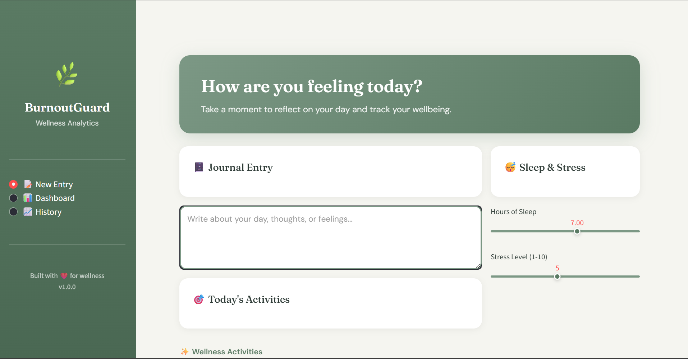
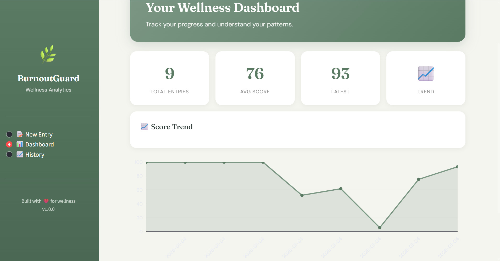
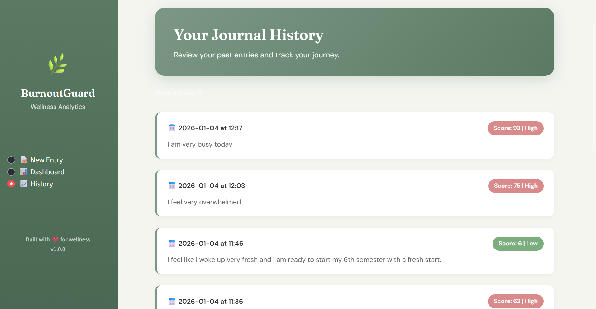

# 🌿 BurnoutGuard

An AI-powered burnout detection system that analyzes journal entries to detect emotional patterns and calculate burnout risk.

Built as a personal project to learn full-stack development with NLP integration.

---

## What It Does

- Analyzes journal text using NLP to detect emotions (sadness, joy, anger, etc.)
- Tracks daily activities, sleep, and stress levels
- Calculates a burnout risk score (0-100)
- Gives personalized recommendations based on your inputs
- Saves all entries to track your wellness over time

---

## Tech Stack

- **Backend:** FastAPI, Python
- **Frontend:** Streamlit
- **NLP Model:** HuggingFace Transformers (DistilRoBERTa)
- **Database:** SQLite
- **Charts:** Plotly

---

## How To Run

1. Clone the repo
```bash
   git clone https://github.com/FatimaNawaz101/burnout-guard.git
   cd burnout-guard
```

2. Create and activate virtual environment
```bash
   python -m venv venv
   venv\Scripts\activate
```

3. Install packages
```bash
   pip install transformers torch fastapi uvicorn streamlit requests plotly
```

4. Start backend (Terminal 1)
```bash
   cd backend
   uvicorn main:app --reload
```

5. Start frontend (Terminal 2)
```bash
   cd frontend
   streamlit run app.py
```

6. Open http://localhost:8501 in your browser

---

## How The Score Works

| Factor | Impact |
|--------|--------|
| Negative emotions (sadness, anger) | Increases score |
| Positive emotions (joy) | Decreases score |
| Stress activities (overtime, poor sleep) | Increases score |
| Wellness activities (exercise, meditation) | Decreases score |
| Sleep under 7 hours | Increases score |

**Risk Levels:** Low (0-29) | Moderate (30-59) | High (60-100)

---

## Screenshots

### New Entry & Results


### Dashboard


### History


---

## Author

Fatima Nawaz  
GitHub: [@FatimaNawaz101](https://github.com/FatimaNawaz101)